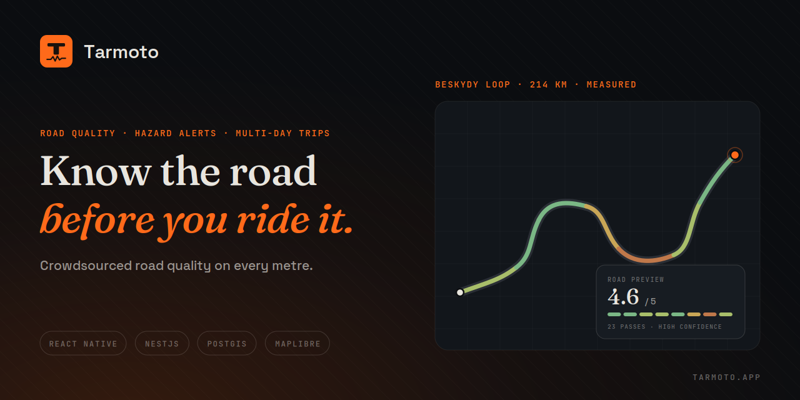

# Tarmoto

> **Know the road before you ride it.**

The motorcycle app that tells you how good the actual road surface is — not just how curvy it looks on a map. Crowdsourced road quality intelligence, real-time hazard alerts, and a multi-day trip planner that replaces hours of Street View scouting.

## Quick Start

```bash
git clone <repo-url> && cd tarmoto
pnpm bootstrap
```

That single command installs dependencies, starts Postgres + Redis, builds shared + backend, copies `.env.example` files, and runs migrations. See [Bootstrap Details](#bootstrap-details) below.

After bootstrap:

```bash
pnpm backend:dev                 # Backend watch mode
pnpm mobile:dev                  # Metro bundler (then `pnpm mobile:ios` / `pnpm mobile:android`)
pnpm companion:dev               # Next.js companion (web)
```

Brand reference (logo SVGs, colour palette, typography rules) lives
as static markdown + SVGs in [`docs/design/brand/`](./docs/design/brand/) —
read it directly on GitHub.

## Prerequisites

- Node.js >= 24 (see `.nvmrc`)
- pnpm >= 11
- Docker & Docker Compose
- Xcode 26.2+ and Ruby 3.3.6 for iOS development
- Android Studio with Android SDK 36, NDK 27.1, and Java 17+ for Android development

## Manual Setup

If `pnpm bootstrap` doesn't fit your environment:

```bash
pnpm install
cp apps/backend/.env.example apps/backend/.env
cp apps/mobile/.env.example apps/mobile/.env
cp apps/companion/.env.example apps/companion/.env
pnpm db:up               # Start PostgreSQL + Redis in Docker
pnpm shared:build        # Build @tarmoto/shared (backend depends on it)
pnpm backend:build       # Compile backend (TypeORM reads compiled data-source)
pnpm db:migrate          # Run migrations against Postgres
pnpm backend:dev         # Start backend in watch mode
```

### Mobile setup

The mobile `.env` may be left at its defaults for simulators: iOS uses
`localhost` and Android uses the emulator host alias `10.0.2.2`. Set
`TARMOTO_API_URL` to the development machine's LAN address when testing on a
physical phone. Firebase configuration is optional for local UI work; push
notifications remain disabled until the platform config file is provided.

```bash
pnpm mobile:ios       # checks Ruby, installs gems/pods, then launches iOS
pnpm mobile:android   # checks Java/SDK, then launches Android
```

See [mobile development and release](./docs/process/mobile-development-release.md)
for native prerequisites, local build checks, CI preview artifacts, Firebase,
and store-release setup.

### After editing `Info.plist` or `AndroidManifest.xml`

Native manifest changes don't propagate through a Metro reload — the
React Native bundle is unchanged, but the underlying iOS/Android binary
still embeds the old manifest. After editing either file:

```bash
# iOS
pnpm --filter @tarmoto/mobile ios:setup
pnpm mobile:ios     # forces a fresh xcodebuild

# Android
cd apps/mobile/android && ./gradlew clean && cd -
pnpm mobile:android
```

If location, sensors, notifications, or photo capture stop working
after a permission edit, 9 times out of 10 the binary on the device is
stale. Uninstall the app and reinstall to be sure — Android in
particular caches the granted permission set per install.

## Project Structure

```
tarmoto/
├── apps/
│   ├── mobile/              Bare React Native (iOS & Android)
│   ├── backend/             NestJS API (serves mobile + web)
│   ├── companion/           Web companion (Next.js + TailwindCSS)
│   ├── admin/               Admin console (Vite SPA + Cloudflare Worker proxy)
│   ├── marketing/           Marketing site (Astro) + waitlist worker
│   ├── poc-sensor/          Road quality sensor PoC (Cloudflare Pages)
│   └── ui-preview/          Local preview harness for @tarmoto/ui
├── packages/
│   ├── brand/               Brand identity system (logos, colors, fonts)
│   ├── shared/              Shared types, constants, DTOs
│   ├── ui/                  Shared UI components
│   ├── openapi/             OpenAPI spec generation from backend
│   └── openapi-client/      Generated OpenAPI TypeScript client
├── docs/
│   ├── specs/               Product spec (canonical)
│   ├── decisions/           ADRs
│   ├── reference/           Architecture overview + reference material
│   ├── process/             Runbook, testing, migrations, DoD, issue workflow
│   ├── design/              Wireframes, ERD
│   └── database/            PostgreSQL + PostGIS schema
├── infra/
│   └── docker/              docker-compose (Postgres + Redis)
└── .github/                 CI workflows, issue templates, deploy pipelines
```

## Commands

| Command                                   | Description                                            |
| ----------------------------------------- | ------------------------------------------------------ |
| `pnpm bootstrap`                          | Full dev environment setup                             |
| `pnpm install`                            | Install workspace dependencies                         |
| `pnpm backend:dev`                        | Start backend in watch mode                            |
| `pnpm backend:build`                      | Build backend                                          |
| `pnpm backend:start`                      | Start backend in production mode                       |
| `pnpm backend:lint`                       | Lint backend                                           |
| `pnpm backend:test`                       | Run backend unit tests                                 |
| `pnpm backend:test:watch`                 | Run backend tests in watch mode                        |
| `pnpm backend:test:cov`                   | Run backend tests with coverage                        |
| `pnpm backend:test:e2e`                   | Run backend E2E tests (requires `pnpm db:up`)          |
| `pnpm backend:db:migrate`                 | Build backend + run TypeORM migrations                 |
| `pnpm companion:dev`                      | Start companion (Next.js) dev server                   |
| `pnpm companion:build`                    | Build companion                                        |
| `pnpm companion:start`                    | Start companion in production mode                     |
| `pnpm companion:lint`                     | Lint companion                                         |
| `pnpm companion:test`                     | Run companion tests (Vitest)                           |
| `pnpm admin:dev`                          | Start admin console dev server                         |
| `pnpm admin:build`                        | Build admin console                                    |
| `pnpm admin:test`                         | Run admin tests (Vitest + worker tests)                |
| `pnpm marketing:dev`                      | Start marketing site dev server                        |
| `pnpm marketing:build`                    | Build marketing site                                   |
| `pnpm mobile:dev`                         | Start Metro bundler                                    |
| `pnpm mobile:ios` / `pnpm mobile:android` | Run mobile on simulator / emulator                     |
| `pnpm poc:dev`                            | Start PoC sensor dev server                            |
| `pnpm poc:build`                          | Build PoC sensor                                       |
| `pnpm shared:build`                       | Build shared package                                   |
| `pnpm openapi:gen`                        | Generate OpenAPI spec + TypeScript client from backend |
| `pnpm db:up`                              | Start PostgreSQL + Redis via Docker                    |
| `pnpm db:down`                            | Stop Docker services                                   |
| `pnpm db:migrate`                         | Alias for `backend:db:migrate`                         |
| `pnpm db:seed`                            | Seed the dev database with demo accounts + activity    |
| `pnpm lint`                               | Lint all packages                                      |
| `pnpm test`                               | Run all tests                                          |
| `pnpm clean`                              | Remove `dist/` + `node_modules/`                       |

## Development Workflow

```
Backend (NestJS + TypeORM + PostGIS)
    ↓  pnpm openapi:gen
OpenAPI spec + TypeScript client  (packages/openapi/ — gitignored)
    ↓
Mobile (React Native) & Companion (Next.js) consume @tarmoto/openapi
```

1. Make backend changes in `apps/backend/` with `@nestjs/swagger` decorators.
2. Run `pnpm openapi:gen` to regenerate the OpenAPI spec and TypeScript client.
3. Mobile and companion import the typed client from `@tarmoto/openapi`.

For database schema changes, see [docs/process/typeorm-migrations.md](./docs/process/typeorm-migrations.md).

## Tech Stack

| Layer           | Technology                                      |
| --------------- | ----------------------------------------------- |
| Mobile          | Bare React Native 0.86, Zustand, MapLibre GL    |
| Companion (web) | Next.js, TailwindCSS, Zustand, MapLibre GL      |
| Backend         | NestJS 11, TypeORM, TypeScript strict           |
| Database        | PostgreSQL 16 + PostGIS 3.4                     |
| Real-time       | WebSockets + Redis Pub/Sub                      |
| On-device ML    | TensorFlow Lite (road-surface classifier)       |
| Contracts       | OpenAPI 3.0 (generated from backend)            |
| Infra           | pnpm workspaces, Docker Compose, GitHub Actions |

## Docs

- [Architecture overview](./docs/reference/architecture.md) — system shape, modules, data flows
- [Product spec](./docs/specs/tarmoto-product-spec.md) — canonical PRD
- [Runbook](./docs/process/runbook.md) — operational response
- [Testing strategy](./docs/process/testing-strategy.md)
- [TypeORM migrations](./docs/process/typeorm-migrations.md)
- [Definition of Done](./docs/process/definition-of-done.md)
- [Issue workflow](./docs/process/issue-workflow.md)
- [ML model spec](./docs/ML_MODEL_SPEC.md)
- [Database schema](./docs/database/README.md) — entities + migrations are the source of truth; `schema.sql` is the frozen executed baseline
- [Wireframes + design specs](./docs/design/)

## Deployment

- **Backend** — Container deploy from [`apps/backend/Dockerfile`](./apps/backend/Dockerfile) onto a self-hosted Coolify PaaS, with managed Postgres (PostGIS via migration) and Redis for queues / pub-sub; Cloudflare R2 for object storage. Push to `main` deploys staging; tag `v*` deploys production via the [`deploy.yml`](./.github/workflows/deploy.yml) orchestrator, which resolves the environment, deploys `apps/ingest` first (the sole POI-schema migrator), then calls the reusable [`backend-deploy.yml`](./.github/workflows/backend-deploy.yml) — triggering the authenticated Coolify deploy API, tracking the deployment to completion, healthchecking, and smoke-testing. On failure it surfaces manual rollback instructions (Coolify v4 has no rollback API). Config is env-scoped to the `staging` / `production` GitHub environments.
- **Companion** — Container deploy from [`apps/companion/Dockerfile`](./apps/companion/Dockerfile) (Next.js standalone + installable PWA) onto the same Coolify PaaS as the backend; push to `main` → staging, tag `v*` → production via [`.github/workflows/companion-deploy.yml`](./.github/workflows/companion-deploy.yml), which stamps the version, triggers the authenticated Coolify deploy API, tracks the deployment to completion, and healthchecks `/health` + the served CSP. One-time enablement: [docs/process/companion-coolify-cutover.md](./docs/process/companion-coolify-cutover.md). (No PR previews — review locally.)
- **Admin console** — Vite SPA + Cloudflare Worker that proxies `/admin/*` same-origin to the backend; deploy via [`.github/workflows/admin-deploy.yml`](./.github/workflows/admin-deploy.yml).
- **Mobile** — Fastlane lanes for iOS TestFlight and Android Play Internal track; manual `workflow_dispatch` or the unified `vX.Y.Z` release tag, see [`.github/workflows/mobile-release.yml`](./.github/workflows/mobile-release.yml).
- **Marketing site** — Astro static site + waitlist Cloudflare Worker deployed to Cloudflare Workers via [`.github/workflows/marketing-deploy.yml`](./.github/workflows/marketing-deploy.yml).
- **PoC sensor** — Cloudflare Pages on push to `main` via [`poc-deploy.yml`](./.github/workflows/poc-deploy.yml).

Deploy / rollback runbook is in [docs/process/runbook.md](./docs/process/runbook.md#deploys).

## Bootstrap Details

`pnpm bootstrap` runs `scripts/bootstrap.sh`, which:

1. Checks prerequisites (node, pnpm, docker)
2. Runs `pnpm install`
3. Copies `.env.example` to `.env` for backend, mobile, and companion (if not present)
4. Starts Postgres + Redis via Docker Compose and waits for Postgres to be healthy
5. Builds `@tarmoto/shared` and the backend (TypeORM needs the compiled data-source)
6. Runs TypeORM migrations
7. Prints the next local commands

## Workspaces

- `@tarmoto/backend` — NestJS API (serves mobile + web)
- `@tarmoto/mobile` — Bare React Native app (iOS & Android)
- `@tarmoto/companion` — Next.js web companion
- `@tarmoto/admin` — admin console (Vite SPA + Cloudflare Worker proxy)
- `@tarmoto/web` — marketing site (Astro) + waitlist worker
- `@tarmoto/poc-sensor` — road-quality sensor PoC
- `@tarmoto/ui` — shared UI components
- `@tarmoto/ui-preview` — local preview harness for `@tarmoto/ui`
- `@tarmoto/shared` — shared types, constants, DTOs
- `@tarmoto/openapi` — OpenAPI spec emission from the backend
- `@tarmoto/openapi-client` — generated OpenAPI TypeScript client

(`docs/design/brand/` is static brand reference — logos, palette, typography — not a workspace.)

## Contributing

See [CONTRIBUTING.md](./CONTRIBUTING.md) for branching, commit conventions, PR flow, and what not to commit. For a system overview see [docs/reference/architecture.md](./docs/reference/architecture.md).

## License

Proprietary — All rights reserved.
