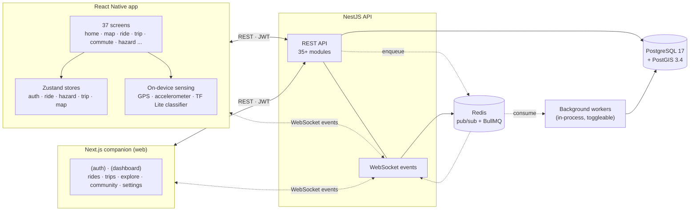

# Architecture Overview

One-page system map for Tarmoto. For product behavior see [../specs/tarmoto-product-spec.md](../specs/tarmoto-product-spec.md). For ops response see [../process/runbook.md](../process/runbook.md). For database migrations see [../process/typeorm-migrations.md](../process/typeorm-migrations.md).

## System shape

## Backend modules

Located under `apps/backend/src/modules/`.

| Module              | Responsibility                                                                                                                                                                                                                                                            |
| ------------------- | ------------------------------------------------------------------------------------------------------------------------------------------------------------------------------------------------------------------------------------------------------------------------- |
| `auth`              | Authentication, JWT, guards                                                                                                                                                                                                                                               |
| `account`           | Subscription billing snapshot, Stripe checkout / portal, webhooks. Mobile IAP is **pending** — moving to RevenueCat webhook ingestion ([design](../superpowers/specs/2026-08-06-mobile-iap-revenuecat-design.md)); the half-built native Apple validate path was deleted. |
| `users`             | User profiles, contacts, followers                                                                                                                                                                                                                                        |
| `rides`             | Active ride recording, segments, GPX export                                                                                                                                                                                                                               |
| `trips`             | Multi-day trips, waypoints, trip members                                                                                                                                                                                                                                  |
| `commute`           | Commute routes and automation                                                                                                                                                                                                                                             |
| `badges`            | Badge / achievement system                                                                                                                                                                                                                                                |
| `challenges`        | Challenges and entry tracking                                                                                                                                                                                                                                             |
| `roads`             | Road segments, reviews, metadata                                                                                                                                                                                                                                          |
| `hazards`           | Hazard reports with types and expiry                                                                                                                                                                                                                                      |
| `safety`            | Safety metrics, incident tracking                                                                                                                                                                                                                                         |
| `sensor`            | On-device surface classification support (backend-side ingest)                                                                                                                                                                                                            |
| `exploration`       | Fun zone discovery                                                                                                                                                                                                                                                        |
| `events`            | WebSocket event broadcasting                                                                                                                                                                                                                                              |
| `tiles`             | Vector tile generation                                                                                                                                                                                                                                                    |
| `weather`           | Weather data integration                                                                                                                                                                                                                                                  |
| `sharing`           | Ride / trip sharing, access control                                                                                                                                                                                                                                       |
| `followers`         | Social follow relationships                                                                                                                                                                                                                                               |
| `database`          | Database utilities (seeders, migration glue)                                                                                                                                                                                                                              |
| `jobs`              | BullMQ queue runner — recurring schedules, processors, health                                                                                                                                                                                                             |
| `bikes`             | Bike garage CRUD, active-bike selection                                                                                                                                                                                                                                   |
| `closures`          | Road closures with detour geometry, route checking                                                                                                                                                                                                                        |
| `email`             | Transactional email (verification, password reset, notifications)                                                                                                                                                                                                         |
| `geocode`           | Place name → coordinates (Nominatim)                                                                                                                                                                                                                                      |
| `group-rides`       | Group ride coordination with live position tracking                                                                                                                                                                                                                       |
| `leaderboards`      | Regional rider leaderboards                                                                                                                                                                                                                                               |
| `map-shares`        | Map viewport / ridden-segments sharing                                                                                                                                                                                                                                    |
| `passes`            | Mountain pass database with seasonal open/close status                                                                                                                                                                                                                    |
| `poi`               | Points of interest — accommodations, fuel, services                                                                                                                                                                                                                       |
| `push`              | Device token registration, push dispatch (FCM + APN)                                                                                                                                                                                                                      |
| `reviews`           | Road segment ratings, reviews, photo uploads, voting                                                                                                                                                                                                                      |
| `route-collections` | Curated route collections with follows, items, slugs                                                                                                                                                                                                                      |
| `storage`           | Object storage abstraction (local disk / S3 / R2)                                                                                                                                                                                                                         |
| `trip-activity`     | Per-trip activity feed (joins, edits, messages)                                                                                                                                                                                                                           |
| `trip-shares`       | Full trip snapshot sharing with HMAC-signed links                                                                                                                                                                                                                         |

Feature modules keep their own guards, pipes, and interceptors colocated — there is **no shared `common/` or `guards/` directory** at `src/`. If you need a helper by more than one module, lift it to `packages/shared`.

## Entities

46 TypeORM entities under `apps/backend/src/entities/`. Core shapes:

- **User graph:** `User`, `UserContact`, `UserFollow`, `UserBadge`, `EmailVerificationToken`, `PasswordResetToken`, `AccountDeletionLog`, `PrivacyPreferencesRow`, `NotificationPreferencesRow`, `DeviceToken`
- **Ride graph:** `Ride`, `RideSegment`, `RideStats`, `SurfaceReading`, `SharedRide`, `CrashAlert`
- **Trip graph:** `Trip`, `TripMember`, `TripDay`, `TripWaypoint`, `TripActivity`, `TripMessage`, `TripSuggestion`, `TripSuggestionVote`, `TripShare`
- **Community & achievements:** `Challenge`, `ChallengeEntry`, `RouteCollection`, `RouteCollectionItem`, `RouteCollectionFollow`, `MapShare`, `RoadReviewVote`
- **Road data:** `RoadSegment`, `RoadReview`, `HazardReport`, `FunZone`, `FunZoneRoad`, `RoadClosure`, `MountainPass`
- **Commute:** `CommuteRoute`
- **Bike:** `Bike`
- **Group rides:** `GroupRide`, `GroupRideMember`
- **Weather:** `WeatherAlertDispatch`
- **Data:** `DataExportRequest`

Geometry columns use PostGIS with SRID 4326 (WGS84).

## Mobile (React Native)

Located under `apps/mobile/src/`.

| Folder        | Purpose                                                                                         |
| ------------- | ----------------------------------------------------------------------------------------------- |
| `screens/`    | 37 screens — feature-based (home, map, ride, trip, commute, hazard, settings, ...)              |
| `stores/`     | Zustand stores: `useAuthStore`, `useRideStore`, `useHazardStore`, `useTripStore`, `useMapStore` |
| `services/`   | API client, location tracking, sensor / ML classification                                       |
| `hooks/`      | Custom React hooks                                                                              |
| `navigation/` | React Navigation configuration                                                                  |
| `theme/`      | Colors, typography, styling                                                                     |
| `types/`      | Shared type definitions                                                                         |

On-device: TensorFlow Lite classifier (`services/mlClassifier.ts`) for road surface type using accelerometer input. Runs locally, no network roundtrip. The trained artifact lives at `apps/mobile/assets/ml/road-surface-classifier.tflite`; its input/output contract is documented in `apps/mobile/assets/ml/MODEL_CONTRACT.md`. When the artifact is unavailable the v0 RMS heuristic produces labels and the upload is tagged `model_version: null`.

## Companion (Next.js web)

Located under `apps/companion/src/`.

| Folder             | Purpose                                                                     |
| ------------------ | --------------------------------------------------------------------------- |
| `app/(auth)/`      | Auth routes: `/login`, `/register`, `/forgot-password`                      |
| `app/(dashboard)/` | Protected routes: `/rides`, `/explore`, `/trips`, `/community`, `/settings` |
| `app/api/`         | Next.js API routes (`/api/auth/...`)                                        |
| `components/`      | Reusable UI components                                                      |
| `lib/`             | API client, auth helpers, socket.io client, types                           |
| `stores/`          | Zustand state (shared shape with mobile where it makes sense)               |
| `middleware.ts`    | Route protection                                                            |

## Key data flows

### Authentication

JWT-based. Mobile and companion both call backend auth endpoints; tokens are stored locally (AsyncStorage on mobile, secure cookies on companion). Every protected route/module uses NestJS guards in the `auth` module.

### Ride recording

Mobile starts a ride → `rides` module creates a row → mobile buffers GPS and accelerometer readings locally → `sensor` service classifies surface → mobile streams segments to backend (`POST /rides/:id/segments`) → backend updates `RideSegment`, `RideStats`, and surface readings → optional real-time broadcast via WebSocket (`events` module).

### Hazard reports

Mobile tap → `hazards` module creates a `HazardReport` with geometry and type → dedupe enforced at the DB level (spatial uniqueness window) → WebSocket broadcast to nearby users via Redis pub/sub.

### Trip planning (companion + backend)

Companion UI calls `trips` module → trip, days, and waypoints persist → `exploration` module feeds "fun zone" suggestions → tiles rendered via `tiles` module backed by custom MapLibre vector tiles.

## Scheduled jobs

Background work runs on **BullMQ** (Redis-backed). The `jobs` module owns the connection, registers fourteen named queues (`ALL_QUEUE_NAMES`), schedules recurring jobs as BullMQ repeatables on application bootstrap, and exposes operational counters at `GET /jobs/health`.

| Queue                       | Cadence                                   | What it does                                                                                                                                                                                                                                                                                                                                                                                                                                                                                                                                                                                                                                                                                                                                                                                        |
| --------------------------- | ----------------------------------------- | --------------------------------------------------------------------------------------------------------------------------------------------------------------------------------------------------------------------------------------------------------------------------------------------------------------------------------------------------------------------------------------------------------------------------------------------------------------------------------------------------------------------------------------------------------------------------------------------------------------------------------------------------------------------------------------------------------------------------------------------------------------------------------------------------- |
| `hazards.cleanup`           | hourly (`0 * * * *`)                      | Flips `is_active = false` on hazard reports past their `expires_at`. Read-side queries kept the same predicate as defense in depth.                                                                                                                                                                                                                                                                                                                                                                                                                                                                                                                                                                                                                                                                 |
| `badges.recheck`            | nightly dispatcher (`30 2 * * *`)         | Scans users with rides in the last 36 h and enqueues a `recheck-user` child job per user. Each child calls `BadgesService.checkAndAward`.                                                                                                                                                                                                                                                                                                                                                                                                                                                                                                                                                                                                                                                           |
| `digest.weekly`             | hourly dispatcher (`0 * * * *`)           | Per-user-timezone Sunday-08:00 fan-out. Each opted-in user gets a `compose` child (template lands with US-63).                                                                                                                                                                                                                                                                                                                                                                                                                                                                                                                                                                                                                                                                                      |
| `account-deletion-sweep`    | daily (`30 3 * * *`)                      | Finds users whose `deletion_scheduled_at` has passed and enqueues `account-deletion-finalize` jobs.                                                                                                                                                                                                                                                                                                                                                                                                                                                                                                                                                                                                                                                                                                 |
| `account-deletion-finalize` | one-shot (per user)                       | Stripe cancel + DB cascade + audit log + confirmation email for one user. Idempotent; the row's eligibility is rechecked under lock.                                                                                                                                                                                                                                                                                                                                                                                                                                                                                                                                                                                                                                                                |
| `data-export`               | one-shot (per request)                    | Assembles the GDPR ZIP bundle. Replaced the prior `setImmediate`-based fire-and-forget; the controller enqueues and returns 202.                                                                                                                                                                                                                                                                                                                                                                                                                                                                                                                                                                                                                                                                    |
| `funzone-recompute`         | weekly Mon `0 4 * * 1`                    | Re-runs the `FunZoneClusteringService` DBSCAN pipeline. The CLI script (`pnpm cluster:fun-zones`) stays for ad-hoc runs.                                                                                                                                                                                                                                                                                                                                                                                                                                                                                                                                                                                                                                                                            |
| `location-retention-sweep`  | daily `0 4 * * *`                         | Drops raw GPS / sensor rows older than each user's `location_retention` preference (#279); aggregated road-quality data is left intact.                                                                                                                                                                                                                                                                                                                                                                                                                                                                                                                                                                                                                                                             |
| `weather-alert-sweep`       | every 15 min `*/15 * * * *`               | Checks weather at active group-ride riders' last positions; dispatches a `weather_alert` push on storm / ice / wind > 60 km/h (per-rider cooldown).                                                                                                                                                                                                                                                                                                                                                                                                                                                                                                                                                                                                                                                 |
| `model-eval-reconcile`      | hourly `0 * * * *`                        | Folds confirmed road-segment quality into unreconciled `model_eval_samples` so the eval gauges get a rolling 24 h denominator (#496).                                                                                                                                                                                                                                                                                                                                                                                                                                                                                                                                                                                                                                                               |
| `model-eval-agreement`      | weekly Mon `0 5 * * 1`                    | Recomputes cross-device / cross-bike agreement scores from the last 7 days of reconciled samples (#496).                                                                                                                                                                                                                                                                                                                                                                                                                                                                                                                                                                                                                                                                                            |
| `nap.closure-poll`          | every ~3 min `*/3 * * * *`                | Polls the Czech NAP (NDIC) DATEX II feed and reconciles official `road_closures` (#743). Dormant until `TARMOTO_NAP_POLL_ENABLED=true`.                                                                                                                                                                                                                                                                                                                                                                                                                                                                                                                                                                                                                                                             |
| `road.import`               | weekly Sun `0 1 * * 0`                    | Imports every configured region's OSM extracts into `road_segments` (#781), ahead of POI import + fun-zones — the **folder model** (Sub-project B) with **sub-region tiling**: each region is subdivided into a `<= TARMOTO_OSM_ROAD_TILE_SPAN_DEG`° grid of per-tile `<code>-r<row>c<col>-s.osm` files (produced by `apps/ingest`'s `refresh-road-extracts` script, clipped from a bbox padded by `TILE_EXTRACT_PAD_DEG`) and imported tile-by-tile (`importAll()` → `importRegion()` → `importTile()`), each tile scoped to the country polygon ∩ tile bbox so peak memory is bounded to one tile. Dormant until `TARMOTO_OSM_ROAD_IMPORT_ENABLED=true`. See "Road-quality extract refresh" in the [runbook](../process/runbook.md#road-quality-extract-refresh-sub-project-b).             |
| `poi.import`                | weekly Sun `0 3 * * 0` (in `apps/ingest`) | **Not one of this module's fourteen queues** — the Phase 3 ingest cutover dropped the backend's `poi.import` registration entirely. The queue (same name), its weekly schedule, and its worker now live wholly inside the separate `apps/ingest` deployable, fanning out staggered `import-region` children that mirror OSM/FSQ POIs into `pois` (#745, #850). The backend's `poi` module never enqueues or processes it: `PoiImportAdminService` only proxies admin reads and the manual trigger to `apps/ingest`'s token-guarded internal API (`GET`/`POST /internal/poi/*`), plus separately handles operator extract uploads to the shared volume. Dormant until `TARMOTO_OSM_POI_IMPORT_ENABLED=true` on `apps/ingest`. See "Deploying `apps/ingest`" in the [runbook](../process/runbook.md). |
| `quality.conflation`        | one-shot (after `road.import`)            | Success-continuation of `road.import`: injects an OSM `smoothness` tag per way so GraphHopper can weight quality-aware routes (#779). Dormant until `TARMOTO_QUALITY_CONFLATION_ENABLED=true`.                                                                                                                                                                                                                                                                                                                                                                                                                                                                                                                                                                                                      |

**Retry policy:** every job retries up to 5 attempts with exponential backoff (30 s → 60 s → 2 m → 4 m → 8 m). Idempotency keys (`jobId`) are set on every producer that has a natural dedup target (request id, user id, or `user_id + window`).

**Worker mode:** `TARMOTO_QUEUE_WORKER_ENABLED` controls whether the process attaches workers. Default ON for single-container dev; set `false` on the API container to run a separate worker process. Producers (the rest of the app calling `JobsProducer`) still work the same — they just enqueue without consuming.

**Health endpoint:** `GET /jobs/health` returns per-queue counters (waiting / active / delayed / completed / failed) and a summary of the most recent failed job per queue. Public, throttle-skipped, suitable for status-page polling.

**Implementation:** see `apps/backend/src/modules/jobs/` for processors, the scheduler, and the producer. Existing `@Cron` jobs in `auth/` (token cleanup) intentionally stay — they don't need queue retry semantics.

## External dependencies

| Dependency                         | Purpose                                              | Failure behavior                                                                                                                                                                                                     |
| ---------------------------------- | ---------------------------------------------------- | -------------------------------------------------------------------------------------------------------------------------------------------------------------------------------------------------------------------- |
| PostgreSQL 17 + PostGIS 3.4        | Primary store + geospatial queries                   | Migrations run on container start via `typeorm migration:run`; already-applied migrations are skipped                                                                                                                |
| Redis                              | WebSocket pub/sub + BullMQ background job queue      | Real-time features degrade; queues stop draining (existing rows accumulate, new submissions still 202 with row in `queued` state); REST still works                                                                  |
| Stripe Billing                     | Web subscription checkout, customer portal, invoices | Account billing actions fail closed; existing persisted subscription state remains readable                                                                                                                          |
| TensorFlow Lite on device (mobile) | Road surface classification                          | Mobile falls back to the v0 RMS heuristic in `services/sensors.ts` if the model fails to load (single warning logged); each upload tags rows with `model_version` so retired classifiers can be filtered server-side |
| MapLibre GL tile server (custom)   | Vector tiles for maps                                | Clients show a simplified base layer while tiles are unavailable                                                                                                                                                     |
| Cloudflare Pages                   | PoC sensor hosting                                   | Only affects `apps/poc-sensor`                                                                                                                                                                                       |

No Firebase, no push notification service, no paid external APIs today.

## Deploy topology

Operational playbooks (rollback per platform, secret rotation) live in [../process/runbook.md](../process/runbook.md#deploys).

- **Backend** runs as a container from [`apps/backend/Dockerfile`](../../apps/backend/Dockerfile) on a self-hosted PaaS. Postgres + PostGIS on a managed Postgres service (`postgis/postgis:17-3.4-alpine`, extension created via TypeORM migration), Redis on a managed Redis service (`redis:8-alpine`, BullMQ + socket.io adapter), uploads / exports on **Cloudflare R2** (S3-compatible — same `@aws-sdk/client-s3` driver, endpoint override). TLS terminated at the PaaS reverse proxy (Let's Encrypt). App secrets are env vars on the PaaS application. Auto-migration runs on container start via `typeorm migration:run`. Deploy model: push to `main` → staging, push tag `v*` → production.
- **Companion** runs on **Cloudflare Workers** (Workers + Static Assets) via [`@opennextjs/cloudflare`](https://opennext.js.org/cloudflare). Staging on push to `main`, production on tag `v*` (no PR previews — review companion changes locally).
- **Admin console** is a Vite SPA on **Cloudflare Workers**: `apps/admin/worker.mjs` serves the static build and proxies `/admin/*` same-origin to the backend's prefix-less admin routes (injecting the `x-internal-token` the backend's `InternalGuard` requires), so the `tarmoto_admin_*` session cookies stay first-party. The GitHub OAuth callback lands on `/admin/auth/sso/github/callback`. Staging on push to `main`, production on tag `v*`.
- **Marketing site** is an Astro static site + waitlist Cloudflare Worker on **Cloudflare Workers**. Staging on push to `main`, production on tag `v*`.
- **Mobile** ships via **Fastlane** to **TestFlight** (iOS) and **Play Internal** (Android), gated behind a `mobile-release` GitHub environment for credential isolation. Releases fire from the unified `vX.Y.Z` git tag (same tag that ships backend/companion/marketing) or a manual `workflow_dispatch`. Accepted tradeoff: a `v*` tag rebuilds mobile too; for a server-only hotfix, use `workflow_dispatch` on the specific deploy instead of cutting a tag.
- **PoC sensor** stays on **Cloudflare Pages** via the existing `poc-deploy.yml`.
- **Local dev** uses Docker Compose for Postgres + Redis (`infra/docker/docker-compose.yml`); the backend runs via `pnpm backend:dev`, mobile via Metro, companion via `pnpm companion:dev`.

Workflows: [`deploy.yml`](../../.github/workflows/deploy.yml) is the orchestrator — it resolves staging vs production (push to `main`, tag `v*`, or a `workflow_dispatch` choice) and calls the reusable [`ingest-deploy.yml`](../../.github/workflows/ingest-deploy.yml) then [`backend-deploy.yml`](../../.github/workflows/backend-deploy.yml) (backend only after ingest succeeds), which trigger the Coolify deploy API, track the deployment to completion, run the smoke test, and surface manual rollback instructions on failure. [`companion-deploy.yml`](../../.github/workflows/companion-deploy.yml) (staging + production), [`admin-deploy.yml`](../../.github/workflows/admin-deploy.yml) (admin console), [`marketing-deploy.yml`](../../.github/workflows/marketing-deploy.yml) (marketing site), [`mobile-release.yml`](../../.github/workflows/mobile-release.yml) (TestFlight + Play Internal). Post-deploy verification is `scripts/smoke/smoke.sh`.
