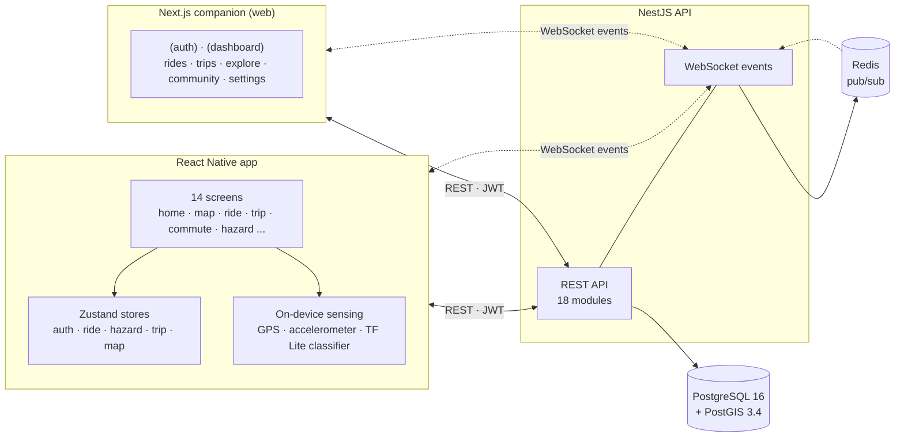

# Architecture Overview

One-page system map for Tarmoto. For product behavior see [../specs/tarmoto-product-spec.md](../specs/tarmoto-product-spec.md). For ops response see [../process/runbook.md](../process/runbook.md). For database migrations see [../process/typeorm-migrations.md](../process/typeorm-migrations.md).

## System shape

## Backend modules

Located under `apps/backend/src/modules/`.

| Module | Responsibility |
| --- | --- |
| `auth` | Authentication, JWT, guards |
| `users` | User profiles, contacts, followers |
| `rides` | Active ride recording, segments, GPX export |
| `trips` | Multi-day trips, waypoints, trip members |
| `commute` | Commute routes and automation |
| `badges` | Badge / achievement system |
| `challenges` | Challenges and entry tracking |
| `roads` | Road segments, reviews, metadata |
| `hazards` | Hazard reports with types and expiry |
| `safety` | Safety metrics, incident tracking |
| `sensor` | On-device surface classification support (backend-side ingest) |
| `exploration` | Fun zone discovery |
| `events` | WebSocket event broadcasting |
| `tiles` | Vector tile generation |
| `weather` | Weather data integration |
| `sharing` | Ride / trip sharing, access control |
| `followers` | Social follow relationships |
| `database` | Database utilities (seeders, migration glue) |

Feature modules keep their own guards, pipes, and interceptors colocated — there is **no shared `common/` or `guards/` directory** at `src/`. If you need a helper by more than one module, lift it to `packages/shared`.

## Entities

23 TypeORM entities under `apps/backend/src/entities/`. Core shapes:

- **User graph:** `User`, `UserContact`, `UserFollow`, `UserBadge`
- **Ride graph:** `Ride`, `RideSegment`, `RideStats`, `SurfaceReading`, `SharedRide`
- **Trip graph:** `Trip`, `TripMember`, `TripDay`, `TripWaypoint`
- **Community & achievements:** `Challenge`, `ChallengeEntry`
- **Road data:** `Road`, `RoadSegment`, `RoadReview`, `HazardReport`, `FunZone`, `FunZoneRoad`
- **Commute:** `CommuteRoute`

Geometry columns use PostGIS with SRID 4326 (WGS84).

## Mobile (React Native)

Located under `apps/mobile/src/`.

| Folder | Purpose |
| --- | --- |
| `screens/` | 14 screens — feature-based (home, map, ride, trip, commute, hazard, settings, ...) |
| `stores/` | Zustand stores: `useAuthStore`, `useRideStore`, `useHazardStore`, `useTripStore`, `useMapStore` |
| `services/` | API client, location tracking, sensor / ML classification |
| `hooks/` | Custom React hooks |
| `navigation/` | React Navigation configuration |
| `theme/` | Colors, typography, styling |
| `types/` | Shared type definitions |

On-device: TensorFlow Lite classifier for road surface type using accelerometer input. Runs locally, no network roundtrip.

## Companion (Next.js web)

Located under `apps/companion/src/`.

| Folder | Purpose |
| --- | --- |
| `app/(auth)/` | Auth routes: `/login`, `/register`, `/forgot-password` |
| `app/(dashboard)/` | Protected routes: `/rides`, `/explore`, `/trips`, `/community`, `/settings` |
| `app/api/` | Next.js API routes (`/api/auth/...`) |
| `components/` | Reusable UI components |
| `lib/` | API client, auth helpers, socket.io client, types |
| `stores/` | Zustand state (shared shape with mobile where it makes sense) |
| `middleware.ts` | Route protection |

## Key data flows

### Authentication
JWT-based. Mobile and companion both call backend auth endpoints; tokens are stored locally (AsyncStorage on mobile, secure cookies on companion). Every protected route/module uses NestJS guards in the `auth` module.

### Ride recording
Mobile starts a ride → `rides` module creates a row → mobile buffers GPS and accelerometer readings locally → `sensor` service classifies surface → mobile streams segments to backend (`POST /rides/:id/segments`) → backend updates `RideSegment`, `RideStats`, and surface readings → optional real-time broadcast via WebSocket (`events` module).

### Hazard reports
Mobile tap → `hazards` module creates a `HazardReport` with geometry and type → dedupe enforced at the DB level (spatial uniqueness window) → WebSocket broadcast to nearby users via Redis pub/sub.

### Trip planning (companion + backend)
Companion UI calls `trips` module → trip, days, and waypoints persist → `exploration` module feeds "fun zone" suggestions → tiles rendered via `tiles` module backed by custom MapLibre vector tiles.

## Scheduled jobs

None currently defined. If cron-style work lands (ride state reconciliation, hazard expiry sweeps, etc.), document here with schedule and purpose.

## External dependencies

| Dependency | Purpose | Failure behavior |
| --- | --- | --- |
| PostgreSQL 16 + PostGIS 3.4 | Primary store + geospatial queries | Migrations run manually via `pnpm db:migrate`; not auto on boot |
| Redis | WebSocket pub/sub across backend instances | Real-time features degrade; REST still works |
| TensorFlow Lite on device (mobile) | Road surface classification | Mobile falls back to "unknown" classification if the model fails to load |
| MapLibre GL tile server (custom) | Vector tiles for maps | Clients show a simplified base layer while tiles are unavailable |
| Cloudflare Pages | PoC sensor hosting | Only affects `apps/poc-sensor` |

No Firebase, no push notification service, no paid external APIs today.

## Deploy topology (current reality)

- **PoC sensor (`apps/poc-sensor`)** deploys to **Cloudflare Pages** via `deploy-poc.yml` on changes under `apps/poc-sensor/**`.
- **Backend, mobile, companion**: **not yet deployed**. Target per AGENTS.md is AWS (ECS + RDS + S3 + CloudFront). Infrastructure-as-code not yet committed.
- **Local dev**: Docker Compose runs Postgres + Redis (`infra/docker/docker-compose.yml`). Backend runs via `pnpm dev:backend`; mobile via Metro + `ios`/`android` scripts; companion via `pnpm dev:companion`.

Expand this section when production deploys are wired up.
